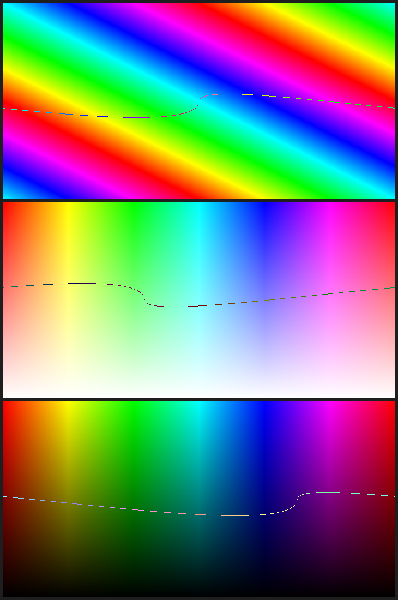

# Tiny-Pixels Engine

## Classes and description

### Adjustment (`Adjustment.h`)
Stores the applicable adjustments to a certain pixel/image.

#### Member variables
The expression after the colon indicates the recommended range. Note that there are limited support for values lying outside the range and should be used with caution. 

- `double brightness`: $[-150, 150]$
- `double contrast`: $[-150, 150]$
- `double hue`: $[-360, 360]$
- `double saturation`: $[-1, 1]$
- `double value`: $[-1, 1]$
- `double lift`: $[-1, 1]$
- `double gamma`: $(0, 10]$
- `double gain`: $[0.5, 1.5]$

`gamma` and `gain` have default value 1 and all other members default to 0.

#### Member methods
- Constructors

    - `Adjustment();` (Default constructor)

        Initializes an `Adjustment` object with default values as mentioned above.

    - `Adjustment(double brightness, double contrast, double hue, double saturation, double value, double lift, double gamma, double gain);`

        Initializes an `Adjustment` object with the specified values
- `static Adjustment& create_adj_hsv(double hue, double saturation, double value);`

    Returns an initialized `Adjustment` object with the indicated hue, saturation, and value; and default values for all other data members.

- `static Adjustment& create_adj_bc(double brightness, double contrast);`
    
    Returns an initialized `Adjustment` object with the indicated brightness and contrast values; and default values for all other data members. 

- `static Adjustment& create_adj_lgg(double lift, double gamma, double gain);`
    
    Returns an initialized `Adjustment` object with the indicated lift, gamma, and gain values; and default values for all other data members. 

### Color (`Color.h`)
Stores data for a particular color in RGBA format. 

#### Member variables

Representing the RGBA channels of a certain color:

- `double r`
- `double g`
- `double b`
- `double a`

Note that it may also represent color in HSV where `r`, `g`, `b` corresponds to hue, saturation, and value, with recommended range $[0, 360)$, $[0, 1]$, and $[0, 1]$ respectively. 

#### Member methods

- Constructors

    - `Color();` (Default constructor)

        Initializes a `Color` object with default values of `r = 0`, `g = 0`, `b = 0`, and `a = 255`.

    - `Color(double r, double g, double b);`

        Initializes a `Color` object with the specified RGB values, `a` defaults to 255.

    - `Color(double r, double g, double b, double a);` 

        Initializes a `Color` object with the specified RGBA values. 
        
    - `Color(Color* color)`

        Initializes a copy of the provided `color`. 

- `void hsv_to_rgb(double h_deg, double s, double v);`
    
    Alters the calling object to be the RGB equivalent of the provided HSV values. 

- `Color& to_hsv();`
    
    Alters the calling object to be the HSV equivalent of the currently stored RGB values. 

- `Color& rgb_to_hsv(double rr, double gg, double bb);`

    Returns a new `Color` object that stores the HSV equivalent of the provided RGB values. 

- `double get(int col);`

    A numeric interface to retrieving member variables with the mapping 

    - 0 $\rightarrow$ `r`
    - 1 $\rightarrow$ `g`
    - 2 $\rightarrow$ `b`
    - 3 $\rightarrow$ `a`

    All other values default to -1

- `void set(double rr, double gg = 0, double bb = 0, double aa = 255);`
    
    Sets the calling object's member variables to the provided values.

- `void set(Color color);`

    Sets the calling object's member variables to match that of the provided `color`.

- `bool set(int col, double val);`

    A numeric interface similar to `Color::get(int col)` that sets the specified variable to the provided value. 

    Return value indicates if the operation was successful.

- `bool operator<(const Color& other) const;`

    Comparison operator that compares the calling object with the provided `color` by `r`, `g`, `b`, in that order. 

- `Color operator+(const Color& other) const;`
    
    Adds two colors component wise.

- `Color operator*(const Color& other) const;`

    Multiplies two colors component wise.

- `Color operator*(double mult) const;`

    Multiplies all member variables in the calling object by `mult`.

- `Color operator/(const Color& other) const;`

    Divides two colors component wise.

- `Color operator/(double div) const;`

    Divides all member variables in the calling object by `div`.

- `static double luminance(double r, double g, double b);`

    Calculates luminance from the given RGB values via $0.2126r + 0.7152g + 0.0722b$.

- `double luminance();`

    Calculates luminance of the calling object.

- `static double luminance(const Color& c);`

    Calculates luminance of the provided `Color` object.

- `Color& apply_adj_rgb(Adjustment adj, double factor);`

    Applies the provided adjustment to the calling color accounting for the provided factor, with 1 being fully applied, and 0 being none applied. 

### Font (`Font.h`)

#### Member variables

Font object from the `schrift` library.

- `SFT sft = {NULL, 12, 12, 0, 0, SFT_DOWNWARD_Y | SFT_RENDER_IMAGE};`

#### Member functions

- Constructor
    
    - `Font(const char* fontfile, uint16_t size);`

        Initializes the font object with the provided TrueType Font (`.ttf`) with the provided size.

- `void setSize(uint16_t size);`

    Sets the font size of the calling object to the provided size.

### Image (`Image.h`)

#### Member variables

- `int w`: width of the image, in pixels
- `int h`: height of the image, in pixels
- `int channels`: number of channels the image holds.
- `size_t size`: size of the image, in bytes, calculated by $w \cdot h \cdot channels$.
- `uint8_t* data`: data of image pointing to an array of size `size`. The `n`th channel byte value for the `r`th row and `c`th column is stored at `data[(r * width + c) * channels + n]`. Rows and columns are 0-indexed and starts from the top left corner of the image. 

#### Member methods

- Constructors

    - `Image(const char* filename);`

        Initializes an `Image` object from the file provided in `filename`. Supported formats are `jpg`, `png`, `bmp`, `tga`.

    - `Image(int w, int h, int channels);`
        
        Initializes an `Image` object with the provided width `w`, height `h`, and number of channels `channels`. All default byte values in `data` are set to 0.

    - `Image(int w, int h, int channels, Color fill);`

        Initializes an `Image` object with the provided width `w`, height `h`, and number of channels `channels`; fills the `data` array with the provided `fill` color. 

    - `Image(const Image& img);`

        Initializes an `Image` from the provided `img` image reference by performing a deep copy. 

- `uint8_t get(uint32_t row, uint32_t col, uint32_t channel = 0);`

    Retrieves the `channel` byte value stored at `row`, `col`.

- `uint8_t get_or_default(int row, int col, uint32_t channel = 0, uint8_t fallback = 0);`

    Similar to `get`, except will default to `fallback` if the coordinate specified by the parameters fall outside the bounds of the calling `Image` object.

- `uint8_t get_offset(int row, int col, uint32_t offset_r, uint32_t offset_c, uint32_t channel = 0);`

    Retrieves the `channel` byte value stored at `row`, `col`, offset by `offset_r` rows and `offset_c` columns.
    
- `uint8_t get_offset_or_default(int row, int col, uint32_t offset_r, uint32_t offset_c, uint32_t channel = 0, uint8_t fallback = 0);`

    Similar to `get_offset`, except will default to `fallback` if the coordinate specified by the parameters fall outside the bounds of the calling `Image` object. 

- `Color get_color(uint32_t row, uint32_t col);`
    
    Retrieves the color of the pixel at `row`, `col` of the calling object.

- `Color get_color_or_default(int row, int col, Color fallback = Color(0, 0, 0));`

    Similar to `get_color`, except will default to `fallback` if the coordinate specified by the parameters fall outside the bounds of the calling `Image` object. 

- `bool set(uint32_t row, uint32_t col, uint32_t channel, uint8_t val);`

    Edits the `channel` byte value for the pixel at `row`, `col` to `val`. Returns if the operation was successful. 
    
- `bool set_offset(int row, int col, uint32_t offset_r, uint32_t offset_c, uint32_t channel, uint8_t val);`

    Similar to `set`, except will offset the coordinates of the modified pixel by `offset_r` rows and `offset_c` columns. 

- `Image& grayscale_avg();`

    Modifies the calling object to reflect the average grayscale of the original data. 

- `Image& grayscale_lum();`

    Modifies the calling object to reflect the luminosity grayscale of the original data. 

- `Image& color_mask(float r, float g, float b);`

    Multiplies the byte values stored in the red, green, and blue channels in the image by `r`, `g`, `b`, respectively. 

    Note that `r`, `g`, `b`, should be in the range $[0, 1]$.

- `Image& encodemessage(const char* message);`
    
    Encodes `message` into the image with minimal changes to the image appearance. 

- `Image& decodemessage(char* buffer, size_t* messageLength);`
    
    Decodes the message from the calling object, storing the length in `messageLength` and the decoded string into `buffer`.

- `Image& diffmap(Image& img);`

    Produces a difference map of the original image data of the calling object with the provided `img`. 

- `Image& diffmap_scale(Image& img, uint8_t scl = 1);`
    
    Similar to `diffmap`, except will scale the final output such that the data fully saturates the $[0, 255]$ range. 

    In other words, it will scale the pixels by $\frac{255}{\max(1, \;scl,\; largest)}$, where `largest` is the largest pixel value in the original diff map. 

- `Image& std_convolve_clamp_to_zero(uint8_t channel, uint32_t ker_w, uint32_t ker_h, double ker[], uint32_t cr, uint32_t cc, bool normalize = false);`

    Performs the standard, unoptimized convolution operation on the specified `channel` of the calling image via the kernel `ker`. The kernel `ker` should have width `ker_w`, height `ker_h`, with center row `cr`, center column `cc`. 

    The result will be normalized to saturate the $[0, 255]$ range if the `normalize` flag is `true`.

    Pixels outside the image's bounds will assume the value 0, hence the function name.

- `Image& std_convolve_clamp_to_border(uint8_t channel, uint32_t ker_w, uint32_t ker_h, double ker[], uint32_t cr, uint32_t cc, bool normalize = false);`

    Similar to `std_convolve_clamp_to_zero`, except pixels outside the image's bounds will assume the value of the border pixel closet to its coordinate. 

- `Image& std_convolve_cyclic(uint8_t channel, uint32_t ker_w, uint32_t ker_h, double ker[], uint32_t cr, uint32_t cc, bool normalize = false);`

    Similar to `std_convolve_clamp_to_zero`, except pixels outside the image's bounds will assume the value of the pixels on the opposite side of the image. In other words, the pixels will wrap around. Alternatively, imagine the images are tiled. 
    
- `Image& flip_x();`

    Flips the calling `Image` along the x-axis. 

- `Image& flip_y();`

    Flips the calling `Image` along the y-axis. 

- `Image& overlay(const Image& src, int x, int y);`

    Overlays the provided `src` image onto the calling `Image`, with the top left corner of `src` at the `y`th row, `x`th column.

- `Image& overlay_text(const char* txt, const Font& font, int x, int y, uint8_t r = 255, uint8_t g = 255, uint8_t b = 255, uint8_t a = 255);`

    Overlays `txt` in the given `font` and color (as defined by `r`, `g`, `b`, `a`) onto the calling `Image` where the bottom left corner is located the `y`th row, `x`th column. 

- `Image& crop(uint16_t cx, uint16_t cy, uint16_t cw, uint16_t ch);`
    
    Crops the calling `Image` to a width of `cw` and a height of `ch` starting from `cx`, `cy` of the original image. 

- `Image& fd_convolve_clamp_to_zero(uint8_t channel, uint32_t ker_w, uint32_t ker_h, double ker[], uint32_t cr, uint32_t cc, bool normalize = false);`

    Similar to `std_convolve_clamp_to_zero`, except using Fast Fourier Transform for calculations, significantly reducing runtime. 

- `Image& fd_convolve_clamp_to_border(uint8_t channel, uint32_t ker_w, uint32_t ker_h, double ker[], uint32_t cr, uint32_t cc, bool normalize = false);`

    Similar to `std_convolve_clamp_to_border`, except using Fast Fourier Transform for calculations, significantly reducing runtime. 

- `Image& fd_convolve_cyclic(uint8_t channel, uint32_t ker_w, uint32_t ker_h, double ker[], uint32_t cr, uint32_t cc, bool normalize = false);`

    Similar to `std_convolve_cyclic`, except using Fast Fourier Transform for calculations, significantly reducing runtime. 
    
- `Image& convolve_linear(uint8_t channel, uint32_t ker_w, uint32_t ker_h, double ker[], uint32_t cr, uint32_t cc, bool normalize = false);`

    Similar to `std_convolve_clamp_to_zero`, except will select either the standard or FFT methods based on the size of the kernel. 

- `Image& convolve_clamp_to_border(uint8_t channel, uint32_t ker_w, uint32_t ker_h, double ker[], uint32_t cr, uint32_t cc, bool normalize = false);`

    Similar to `std_convolve_clamp_to_border`, except will select either the standard or FFT methods based on the size of the kernel.

- `Image& convolve_cyclic(uint8_t channel, uint32_t ker_w, uint32_t ker_h, double ker[], uint32_t cr, uint32_t cc, bool normalize = false);`

    Similar to `std_convolve_cyclic`, except will select either the standard or FFT methods based on the size of the kernel.

- `Image& brightness(uint8_t channel, double brightness_delta);`

    Adjusts the brightness of specified `channel` of the calling `Image` by `brightness_delta`. 

    The recommended range for `brightness_delta` is $[-150, 150]$.

- `Image& contrast(uint8_t channel, double contrast_delta);`

    Adjusts the contrast of specified `channel` of the calling `Image` by `contrast_delta`. 

    The recommended range for `contrast_delta` is $[-150, 150]$.


- `Image& saturation(int channel, double saturation_delta);`

    Adjusts the saturation of the specified `channel` of the image by the specified `saturation_delta`. To adjust the saturation at once, call the function with `channel = -1`.

    The recommended range for `saturation_delta` is $[-1, 1]$.

- `Image& exposure(double exposure);`

    Changes the exposure of the image by `exposure` EVs.

- `Image& shade_h();`
    
    Produces the normalized y-gradient from the Sobel–Feldman operator. 

    In other words, shades the image like an embosing with the horizontal edges enhanced. 

- `Image& shade_v();`
    
    Produces the normalized x-gradient from the [Sobel–Feldman operator](https://en.wikipedia.org/wiki/Sobel_operator). 

    In other words, shades the image like an embosing with the vertical edges enhanced. 

- `Image& shade();`

    Produces the normalized gradient from the [Sobel–Feldman operator](https://en.wikipedia.org/wiki/Sobel_operator).

    In other words, shades the image like an embosing.

- `Image& edge(bool gradient = false, double detail_threshold = 0.09);`
    
    Applies the [Sobel–Feldman operator](https://en.wikipedia.org/wiki/Sobel_operator) to the image with normalized gradient magnitudes. 

    In other words, detects the edges in the image. 

    The `gradient` flag indicates whether the edges should be shown with their direction gradients. 

    The `detail_threshold` value indicates the degree of small details that are ignored. 

- `Image& f_scale(uint32_t new_w, uint32_t new_h, bool linked = false, TwoDimInterp method = TwoDimInterp::Nearest);`

    Fractionally scales the image to width `new_w`, height `new_h` using the interpretation method `method`. 

    Currently, the interpolation methods supported are `TwoDimInterp::Nearest` and `TwoDimInterp::Bilinear`.

    To proportionally scale the image to a width of `new_w`, toggle the `linked` flag to `true`, which will result in `new_h` being ignored. 

- `Image& translate(int x, int y, Color fill = Color(0, 0, 0, 255));`

    Translates the image horizontally by `x` and vertically by `y`, where rightwards and downwards are defined to be the positive direction.

    The blank spaces will be filled with the color specified by `fill`.

- `Image& rotate(double origin_x, double origin_y, double angle, TwoDimInterp method = TwoDimInterp::Bilinear, Color fill = Color(0, 0, 0));`

    Rotates the image `angle` degrees clockwise about $(origin\_x,\; origin\_y)$ determined from the top left corner of the image.

    Pixels in the new image will be interpolated by the method specified by `method`. Currently, the supported methods are `TwoDimInterp::Nearest` and `TwoDimInterp::Bilinear`.

    The blank spaces from the rotation will be filled with the color specified by `fill`.

- `Image& invert_color(uint8_t channel);`

    Inverts the color of the specified `channel` in the calling `Image`.

- `Image& gamma(uint8_t channel, double gamma_delta);`

    Adjusts the specified `channel` of the image by applying the provided `gamma_delta`.

    Recommended range for `gamma_delta` is $(0, 10]$, where a value of 1 will result in the original image. 

- `Image& color_reduce(ColorDepth depth = ColorDepth::Bit_3, bool error_diffusion = true);`

    Reduces the colors of the image to the specified color depth as defined by `depth`, applying the Floyd-Steinberg error diffusion as per the `error_diffusion` flag.

    Available color depths are `Bit_3`, `Bit_8`, and `Bit_16`.

- `Image& color_ramp(std::vector<std::pair<double, Color>> points, OneDimInterp method = OneDimInterp::Linear);`

    Applies a color gradient transformation to the average grayscale values of the calling `Image`. The gradient is defined by the control `points` and interpolated via the specified `OneDimInterp method`.

    Supported `OneDimInterp` methods include `Constant`, `Linear`, `BSpline`, and `Bezier`.

    The following is an example of a color ramp preview from demo:

    

- `Image& preview_color_ramp(std::vector<std::pair<double, Color>> points, OneDimInterp method = OneDimInterp::Linear) const;`

    Generates a 256 $\times$ 20 preview of the interpolated color ramp defined by the control `points`, interpolated via the specific `OneDimInterp method`. 
    
    Supported `OneDimInterp` methods follow from the `color_ramp` method.

- `std::vector<Image*> separate_channels();`

    Separates the channels of the calling `Image` object and returns the references in a vector.

- `Image& combine_channels(std::vector<Image*> imgs, bool resize_to_fit = false, TwoDimInterp method = TwoDimInterp::Bilinear);`

    Combines the provided `imgs` as channels to produce an image of width $\max\{imgs[i].w\}$, height $\max\{imgs[i].h\}$, and replaces the calling `Image` object.

    If the `resize_to_fit` flag is `true`, all smaller images will be resized to have the same width and height as the final output using the interpolation `method` specified. 

    Supported `TwoDimInterp` methods follow from the `f_scale` function.

- `Image& set_alpha(Image& alph, bool resize_to_fit = false, TwoDimInterp method = TwoDimInterp::Bilinear);`

    Sets the `alpha` channel of the calling `Image` to take on the first channel value of the `alph` image. If the two images are not the same size, the alpha channel defaults to 255 (opaque).

    If the `resize_to_fit` flag is `true`, the `alph` image will be resized to have the same width and height as the calling `Image`using the interpolation `method` specified. 

    Supported `TwoDimInterp` methods follow from the `f_scale` function.

- `Image& color_balance(Color lift, Color gamma, Color gain);`
    
    Adjusts the color balance of the calling `Image` by `lift`, `gain`, and `gamma`.

- `Image& histogram(bool inc_lum = true, int channel = -1, Color fill = Color(125, 125, 125));`

    Produces the histogram of the calling `Image`.

    The `inc_lum` flag indicates whether to include the luminosity levels.

    A non-negative value for `channel` will limit the histogram for that specific channel and fill the bars with `fill`. Otherwise, the histogram will display the red, green, and blue channels. 

- `Image& histogram_lum(Color fill = Color(125, 125, 125));` 

    Produces the histogram for the luminosity grayscale values of the calling `Image`.

- `Image& histogram_avg(Color fill = Color(125, 125, 125));`

    Produces the histogram for the average grayscale values of the calling `Image`.

- `Image& HSV(double hue_delta, double saturation_delta, double value_delta);`

    Adjusts the hue, saturation, and values for the calling `Image`.

    Recommended range for each parameter is listed below
    - `hue_delta`: $[-360, 360]$
    - `saturation_delta`: $[-1, 1]$
    - `value_delta`: $[-1, 1]$


- `Image& false_color(bool overwrite = false);`

    Produces the false color image based on the luminance values for the calling `Image` object. 

    `overwrite` indicates whether to overwrite the calling image with its false color.

    The following is an illustrative sample of false color corresponding to each luminance level. The base color ramp below is provided as a reference for luminance. 

    <br/>
    

- `Image& tone_correct(uint8_t midtones_start, uint8_t midtones_end, Adjustment shadow, Adjustment midtone, Adjustment highlight);`

    Adjusts the image based on the specified `shadow`, `midtones`, and `highlight` adjustments delimited by `midtones_start` and `midtones_end`.

- `RGB_curves`

    Full header is shown below:
    ```cpp
    Image& RGB_curves(OneDimInterp method = OneDimInterp::Bezier,
                        std::vector<std::pair<double, double>> control_c = {{0, 0}, {0, 0}, {1, 1}, {1, 1}},
                        std::vector<std::pair<double, double>> control_r = {{0, 0}, {0, 0}, {1, 1}, {1, 1}},
                        std::vector<std::pair<double, double>> control_g = {{0, 0}, {0, 0}, {1, 1}, {1, 1}},
                        std::vector<std::pair<double, double>> control_b = {{0, 0}, {0, 0}, {1, 1}, {1, 1}});
    ```
    
    Adjusts the image based on the control parameters. 

    `control_c` adjusts all color channels at once, while `control_r`, `control_g`, `control_b` adjusts each color channel individually. 

    Values in the controls should be of pairs in the form $\{x, v\}$, where $x \in [0, 1]$, indicating the x-position of the control point; $v \in [0, 1]$, indicating the value of the point. 

    The curve will be interpolated by `method`, which supports `Bezier` and `BSpline`.

- `preview_RGB_Curves`

    Full header is shown below:
    ```cpp
    Image& preview_RGB_curves(OneDimInterp method = OneDimInterp::Bezier,
                              std::vector<std::pair<double, double>> control_c = {{0, 0}, {0, 0}, {1, 1}, {1, 1}},
                              std::vector<std::pair<double, double>> control_r = {{0, 0}, {0, 0}, {1, 1}, {1, 1}},
                              std::vector<std::pair<double, double>> control_g = {{0, 0}, {0, 0}, {1, 1}, {1, 1}},
                              std::vector<std::pair<double, double>> control_b = {{0, 0}, {0, 0}, {1, 1}, {1, 1}});
    ```
    Generates a 527 $\times$ 527 preview of the RGB curves. Parameters follow from `RGB_curves`.

    The following is an example of an RGB curves preview from demo:

    

- `hue_correct`

    Full header is shown below:
    ```cpp
    Image& hue_correct(std::vector<std::pair<double, double>> control_h = {{179, 0}, {180, 0}, {181, 0}},
                       std::vector<std::pair<double, double>> control_s = {{179, 0}, {180, 0}, {181, 0}},
                       std::vector<std::pair<double, double>> control_v = {{179, 0}, {180, 0}, {181, 0}});
    ```
    Adjusts the hue, saturation, and value based on the controls. Note that the controls curves are interpolated cyclically by `OneDimInterp::Bezier` to result in a smooth adjusted result. 

    The number of points in each control list should be a multiple of 3, where points at indices $i \equiv 1 \mod 3$ are end points, while the rest are handles. 
    
- `preview_hue_correct`

    Full header is shown below: 
    ```cpp
    Image& preview_hue_correct(std::vector<std::pair<double, double>> control_h = {{179, 0}, {180, 0}, {181, 0}},
                               std::vector<std::pair<double, double>> control_s = {{179, 0}, {180, 0}, {181, 0}},
                               std::vector<std::pair<double, double>> control_v = {{179, 0}, {180, 0}, {181, 0}});
    ```
    Displays a 730 $\times$ 1100 preview of the adjustments of each control on the image, comprised of three 360 $\times$ 720 sub-images, each displaying one adjustment.

    The following is an example of a hue correct preview from demo:

    

- `Image& blur(Blur method = Blur::Gaussian, int radius_x = 5, int radius_y = 5);`

    Blurs the image with the specified `radius_x` and `radius_y`, using the specified `method`. 

    Supported methods are `Gaussian` and `Box`.

- `Image& alpha_overlay(Image* fac, int fac_x, int fac_y, Image* other, int other_x, int other_y);`
    
    Overlays the `other` image placed at row `other_y`, column `other_x` onto the calling image with an alpha factor determined by the `fac` mask placed at row `fac_y`, column `fac_x`.

- `Image& alpha_overlay(Color color, Image* other, int other_x, int other_y);`

    Similar to the above, except using a single color to define the alpha overlay factor.

- `Image& alpha_overlay(Image* fac, int fac_x, int fac_y, Color other);`

    Similar to the above, except overlaying a color `other` with an alpha factor determined by the `fac` mask. 

- `Image& alpha_overlay(Color color, Color other);`

    Similar to the above, expect overlaying the `other` color with an alpha factor determined by the `color`.

- `Image& vignette(double fact_x = 0, double fact_y = 0);`

    Vignettes the calling `Image` with the amount of horizontal vignetting determined by `fact_x`, and amount of vertical vignetting determined by `fact_y`. 

- `Image& color_matrix(std::vector<std::vector<double>> matrix);`

    Applies the specified color `matrix` to the calling `Image` object. 

- `Image& rect_mask(double start_x, double start_y, double end_x, double end_y, Color fill = Color(255, 255, 255));`

    Generates a rectangular mask that matches the size of the calling `Image`. The rectangle starts and ends at the specified parameters, with a black background and the masked area filled with `fill`

- `Image& ellipse_mask(double center_x, double center_y, double radius_x, double radius_y, Color fill = Color(255, 255, 255));`

    Generates an elliptical mask with the same dimensions as the calling `Image`. The ellipse is centered and sized according to the specified parameters, with a black background and the ellipse filled with `fill`.

- `Image& white_noise(double min = 0.0, double max = 255.0, bool color = true, int seed = 0);`

    Generates white noise with a minimum value of `min` and a maximum value of `max` using the provided `seed`. To create monotone noise, set the `color` flag to `false`.

- `Image& perlin_noise(double min = 0.0, double max = 255.0, int grid_size = 400, double freq = 1, double amp = 1, int seed = 0);`

    Generates Perlin noise with a minimum value of `min`, a maximum value of `max`, and a `grid_size` in pixels, using the provided `seed`.

    The frequency `freq` determines the number of subdivisions used in the noise calculation, while the amplitude `amp` controls the saturation level within the specified `[min, max]` range.

### Interpolation (`Interpolation.h`)

